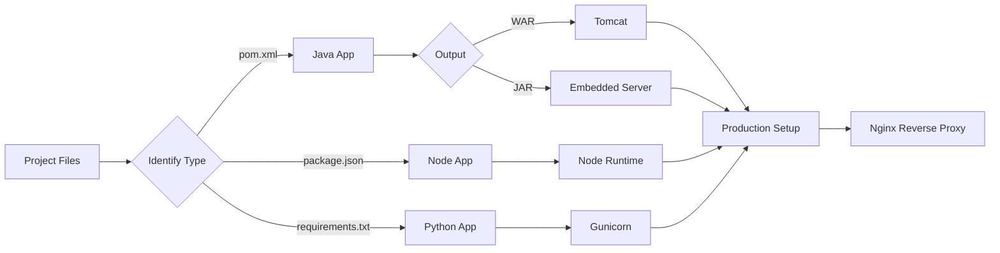

# 🚀 Server Selection Guide

### 💡 *Which Server Runs What? (DevOps Cheat Sheet)*

<p align="center">
  
  
  
</p>

---

## 🌟 Why This Guide?

Many developers get confused about:

❓ Which server to use?
❓ Which file builds what?
❓ How to identify project type quickly?

👉 This guide solves everything in a **simple + practical way**.

---

# 🧠 Step 1: Identify Build Tool

```bash
.csproj/Program.cs            → .NET
pom.xml                       → Maven  
build.gradle                  → Gradle  
package.json                  → Node.js  
requirements.txt              → Python  
composer.json                 → PHP  
```

---

# 📦 Step 2: Identify Build Output

```bash
Java (Spring Boot) → .jar  
Java Web App       → .war  
React/Angular      → build/ or dist/  
Node/Python        → No build (runs directly)  
```

---

# ⚙️ Step 3: Choose Server

## ☕ Java Applications

```bash
.jar  → Embedded Server (Spring Boot)
.war  → Tomcat (Servlet Container)
```

---

## 🌐 Frontend Applications

```bash
React / Angular / HTML → Nginx
```

---

## ⚙️ Backend Applications

```bash
Node.js   → Node runtime (Express)
Python    → Gunicorn / uWSGI
PHP       → PHP-FPM + Nginx
.NET      → Kestrel / IIS
```
| Application | Server          |
| ----------- | --------------- |
| Java WAR    | Tomcat          |
| Java JAR    | Embedded Server |
| React       | Nginx           |
| Node.js     | Node Runtime    |
| Python      | Gunicorn        |
| PHP         | PHP-FPM + Nginx |

---

# ❌ Common Mistake

```bash
❌ Using Nginx for Java apps
```

👉 Why wrong?

* Nginx cannot run `.jar` or `.war`
* It only serves static content
* Works as reverse proxy

---

# 🔥 Real Production Architecture

```bash
Client → Nginx → Application Server → Database
```

### 💡 Examples:

```bash
Nginx → Tomcat → MySQL  
Nginx → Node.js → MongoDB  
Nginx → Gunicorn → Django  
```

---

# 🎯 Quick Decision Trick

✔️ Check build file
✔️ Check folder structure
✔️ Identify output
✔️ Select server

---

# ⚡ Final Cheat Sheet

| Application | Server          |
| ----------- | --------------- |
| Java WAR    | Tomcat          |
| Java JAR    | Embedded Server |
| React       | Nginx           |
| Node.js     | Node Runtime    |
| Python      | Gunicorn        |
| PHP         | PHP-FPM + Nginx |

---

# 🎨 Visual Flow



---

# 💎 Pro Tips

✨ Server depends on **runtime**, not guess
✨ Nginx = frontend + proxy (not backend runtime)
✨ Always identify project before writing Dockerfile

---
# 🔥 Dockerfile Templates

---

## ✅ .NET Backend

```dockerfile
FROM mcr.microsoft.com/dotnet/sdk:7.0 AS build
WORKDIR /app
COPY . .
RUN dotnet restore
RUN dotnet publish -c Release -o /out

FROM mcr.microsoft.com/dotnet/aspnet:7.0
WORKDIR /app
COPY --from=build /out .
EXPOSE 80
ENTRYPOINT ["dotnet", "YourApp.dll"]

```
---

## ✅ Node.js Application

```dockerfile
FROM node:18

WORKDIR /app

COPY package*.json ./
RUN npm install

COPY . .

EXPOSE 3000

CMD ["npm", "start"]
```
---
## ✅ Python
```dockerfile
FROM python:3.10
WORKDIR /app
COPY . .
RUN pip install -r requirements.txt
EXPOSE 5000
CMD ["python", "app.py"]
```
---
## ✅ Java (Spring Boot)
```dockerfile
FROM openjdk:17
WORKDIR /app
COPY target/app.jar app.jar
EXPOSE 8080
ENTRYPOINT ["java", "-jar", "app.jar"]
```
---
## ✅ React / Static Website (Nginx)
```dockerfile
FROM nginx:alpine
COPY build/ /usr/share/nginx/html
EXPOSE 80
